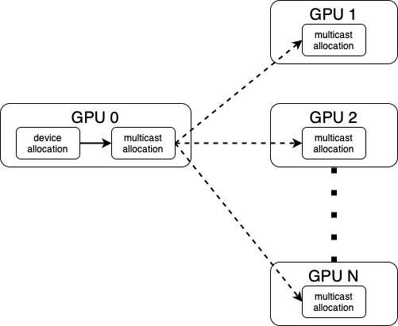

# nvloom

Nvloom is a set of tools designed to scalably test MNNVL fabrics. It consists of a library and command-line tool.

**Disclaimer: nvloom is still in active and early development. All interfaces might be subject to change in the future.**

## library

The purpose of the library is to simplify integrating MNNVL testing into an application.

Mininium requirements:
- CUDA 12.8.1
- 570.124.06 driver
- MPI
- C++17
- Cmake 3.20
- Boost.program_options 1.74

There are two ways to integrate the library into an application

### .so file

The library can be built as a shared library.

`cd library && cmake . && make`

This will build `libnvloom.so` which can be linked from the application.

The `library` directory can be added to the build system as an include directory.

### source code

Alternatively, the libray source code can be added to an application.

Files `allocators.cpp`, `kernels.cu` and `nvloom.cpp` (and c) need to be added to the build system, along with all the headers.

### library entry point

In the application, including `nvloom.h` will include all necessary headers.

### library design

Can be found in library/README.md.

## command line tool

While the library is designed to be integrated into a multitude of projects, for ease of use a sample command line interface is provided to get started.

Tests are grouped into suites for ease of use.

Current suites:
1. `pairwise` - typical O(n^2), one pair at a time testing
2. `fabric-stress` - testcases where every single GPU is writing/reading to/from some other GPU at the same time
3. `all-to-one` - testcases where multiple GPUs access memory on a single GPU
4. `multicast` - multicast benchmarks
5. `egm` - typical O(n^2) pairwise testing for EGM
6. `gpu-to-rack` - for each GPU bandwidth is measured against a constant number of peer GPUs. Those GPUs are selected in a randomized manner. Median is reported. If one GPU has a slower connection to the fabric, it will show up on all its benchmarks, but it should have minimal impact on measurement of other GPUs. This is designed to replicate data from typical pairwise benchmarks, but in linear runtime.
7. `rack-to-rack`. This suite focuses on benchmarking rack-to-rack communication, pushing as many simultaneous copies as possible.
Build it with

`cmake . && make -j`

Run the `nvloom_cli` executable with MPI.

To run a single suite of tests:

`./nvloom_cli -s SUITE_NAME`

To run a single testcases

`./nvloom_cli -t TESTCASE_NAME`

You can get a list of current testcases with

`./nvloom_cli -l`

Running `nvloom_cli` without arguments will run all testcases available. We recommend against it, instead run appropriate testcases or suites targeting your needs. Nvloom contains a very broad variety of benchmarks, and running every single one might not be an optimal use of time.

For a detailed description of all the CLI options, see [testcase reference](#testcase-reference).

# How to benchmark MNNVL domains

For large MNNVL domains, measuring bandwidth between each pair of GPUs can be lengthy. While this project is meant to help with evaluating large MNNVL domains, some testcases are pairwise, executing in O(n^2) time. Such testcases are included to for compatibility with all of `nvbandwidth` testcases, but might not be optimal in run time and could be skipped.

To evaluate a large MNNVL domain, the recommendation is to:

1. Run `gpu-to-rack` suite. For each GPU bandwidth is measured against a constant number of peer GPUs. Those GPUs are selected in a randomized manner. Median is reported. If one GPU has slower connection to the fabric, it will show up on all its benchmarks, but it should have minimal impact on measurement of other GPUs. This is designed to replicate data from typical pairwise benchmarks, but in linear runtime.
2. Run `fabric-stress` suite. This suite focuses on launching many copies simultaneously to saturate the fabric. Each GPU in the MNNVL domain is executing a copy at the same time.
3. Run `rack-to-rack` suite. This suite focuses on benchmarking rack-to-rack communication, pushing as many simultaneous copies as possible.

To run those suites:

```
nvloom_cli -s gpu-to-rack rack-to-rack fabric-stress
```

Both of those suites have variants of SM/CE, write/read, etc.

# How to quickly test a MNNVL fabric

To quickly test MNNVL functionality, running `bisect_write_sm` is recommended. Every single GPU will write to a remote GPU at the same time, running in roughly O(1) time. This test completes in around 3 seconds on a 72-GPU MNNVL domain, including application startup.

```
nvloom_cli -t bisect_device_to_device_write_sm
```

# Terminology

Nvloom_cli contains multiple **suites**

Each suite contains multiple **testcases**

Each testcases executes 1 or more **measurements**

Each measurement can consist of 1 or more simultaneous **copies**

Nvloom(_cli) assumes one process per GPU. Hence, **process** is conflated with **GPU**.

For the remainder of documentation, we define `NUM_GPU` to be the GPU count that nvloom has been launched on. In other worlds, number of processes in `MPI_COMM_WORLD`.

# nvloom_cli options

## --listTestcases

Lists all available testcases that contained in nvloom_cli.

Please note that some testcases might not be available to run based on system configuration. For example, EGM testcases require EGM enabled on the system. However, testcases query availability of features prior to running, and will gracefully waive themselves if requirements are not met.

Controlled with `--listTestcases`/`-l` option.

## --testcase

Controls what testcases are being run during `nvloom_cli` execution. You can obtain list of available testcases with `--listTestcases`/`-l` option.

Controlled with `--testcase`/`-t` option, followed by a list of testcaes.

## --suite

Controls what testcase suites are being run during `nvloom_cli` execution. You can obtain list of available suites with `--help`/`-h` option.

Controlled with `--suite`/`-s` option, followed by a list of suites.

## --allocatorStrategy

Allocator strategy defines how CUDA memory allocations in testcases are handled. There are 3 options available. The default option is `reuse`.

Controlled with `-a` or `--allocatorStrategy` option.

- `unique`: each measurement allocates and frees CUDA memory. This means every single measurement operates on freshly allocated CUDA memory.
- `reuse`: allocations are greedily cached through a C++ wrapper class `AllocationPool`. Allocations in the pool are released at the end of a testcase. This guarantees that each testcase starts with a clean slate, and there's no interference between testcases. However, each testcase will be building the cache from scratch.
- `cudapool`: device and EGM allocations are allocated through CUDA Stream-Ordered Memory Allocator. This strategy utilizes the inherent caching of CUDA memory through the Stream-Ordered Memory Allocator. Multicast allocations are allocated with the `unique` strategy.

## --bufferSize

Controls the size of a buffer that the measurements repeatedly copy.

The default is 512 MiB.

Controlled with `-b` or `--bufferSize` option.

## --richOutput

Controls whether detailed per-measurement data is shown in the output.

When enabled with `-r` or `--richOutput`, individual measurements are shown instead of aggregated statistics. For example, in the `gpu-to-rack` suite, this will show all sample measurements for each rack instead of just the median value. The measurements will be labeled with the specific GPU pairs used.

When disabled (default), only aggregated statistics are shown - for example, just the median value per rack in `gpu-to-rack` suite.

## --gpuToRackSamples

Controls how many samples are taken per rack in the `gpu-to-rack` suite. For each GPU, this many random peer GPUs will be selected from each rack for bandwidth measurements.

The default is 5 samples per rack.

When `--richOutput` is enabled, all sample measurements will be shown. Otherwise, only the median value across the samples is reported.

## --iterations
The `--iterations` option controls how many copy operations are performed within each measurement, not including the initial warmup iteration.

The default is 16.

Controlled with `-i` or `--iterations` option.

## --repeat
The `--repeat` option controls how many times each testcase is executed in a single run. By default, each testcase is run once. You can use this option to repeat the same testcase multiple times.

Controlled with `-c` or `--repeat` option.

For example, `-c 10` will run each selected testcase 10 times in a row.

## --duration

The `--duration` option allows you to specify how long (in seconds) each testcase should be repeated. The testcase will be executed repeatedly until the specified duration has elapsed.

Controlled with `-d` or `--duration` option.

**Note:** You cannot specify both `--duration` and `--repeat` at the same time; only one of these options can be used per run. If neither is specified, each testcase will run once (the default).

# Heatmap plotter

`plot_heatmaps.py` included in the `nvloom_cli` directory produces heatmaps for each testcase of a given `nvloom_cli` output.

To use it, pipe output of `nvloom_cli` into `plot_heatmaps.py` (using an intermediary file is ok).

A heatmap for each testcase will be produced. You can customize the heatmap using following toggles.

## --path

Controls where the output files will be saved. The default is current directory.

Controlled with `-p` or `--path` option.

## --heatmap_lower_limit

Controls the lower limit of the heatmap color scale. By default, the heatmap plots values from 0 up to the maximum value found in the data. This option allows overriding the lower limit if needed.

This is useful if you want to compare heatmaps from different runs with consistent coloring, or if you want to highlight small differences in the upper range of the dataset.

If the specified value is lower than minimum value in the results, plot_heatmaps.py will trigger an assert.

Controlled with `-l` or `--heatmap_lower_limit` option.

## --heatmap_upper_limit

Controls the upper limit of the heatmap color scale. By default, the heatmap plots values from 0 up to the maximum value found in the data. This option allows overriding the upper limit if needed.

This is useful if you want to compare heatmaps from different runs with consistent coloring, or if you want to highlight small differences in the lower range of the dataset.

If the specified value is higher than maximum value in the results, `plot_heatmaps.py` will trigger an assert.

Controlled with `-u` or `--heatmap_upper_limit` option.

## --title_fontsize, --legend_fontsize, --data_fontsize_scaling_factor

Toggles to adjust font scaling of the graphs. `plot_heatmaps.py` attempts to scale text sizes automatically based on plot dimensions, but this can be challenging when input data dimensions vary significantly (e.g. comparing a 2x2 matrix vs 72x72). These options allow manual adjustment of text sizes if the automatic scaling isn't ideal:

- `--title_fontsize` controls the size of plot titles (default 32)
- `--legend_fontsize` controls the size of axis labels and legends (default 24)
- `--data_fontsize_scaling_factor` applies a multiplier to the automatically calculated font size for the data values shown in cells (default 1.0)

For example, you may want to increase `--data_fontsize_scaling_factor` when plotting small matrices to make the numbers more readable, or decrease it for very large matrices to prevent text overlap.

## --plot_size

Controls the size of the output plots in inches. The default is 32 inches.

This option sets both the width and height of the plot, maintaining a square aspect ratio. Larger values will produce higher resolution plots that are easier to read when zoomed in, but will result in larger file sizes.

Controlled with `--plot_size` option.

## --file_format

Controls the output image file format. The default setting is `png`, but you might want to use other format, e.g. vector files.

Available output formats might vary from system to system, as they depend on installed matplotlib backend. `plot_heatmaps.py` allows you to save your heatmaps in any format supported by the installed matplotlib, however only `png`, `svg` and `pdf` have been tested.

# Testcase reference

Each testcase is defined by a combination memcopy pattern, memcopy parameters, and source/destination memory types.

## Memcopy parameters

### SM/CE

A copy can be executed by either Streaming Multiprocessors (SM) or Copy Engines (CE).

SM copies use a custom memcopy kernel to copy memory. This kernel is implemented as part of nvloom.

CE copies are scheduled with `cuMemcpyAsync`, and CUDA Driver programs the copy engines to copy memory.

### Read/write

A write copy executes memory writes over Nvlink. Source buffer is local to the GPU executing the copy, destination buffer is remote.

A read copy executes memory reads over Nvlink. Source buffer is remote to the GPU executing the copy, destination buffer is local.

### Unidir/bidir

Unidirectional copy is a single copy executed from GPU X to GPU Y.

Bidirectional copy is two simultaneous copies executed from GPU X to GPU Y and from GPU Y to GPU X. Sum of two bandwidths is reported as a result.

## Memory types

### Device (VRAM)

Device memory is multinode-nvlink enabled memory allocated in GPU VRAM memory.

### EGM (Extended GPU Memory)

EGM memory is multinode-nvlink enabled GPU accessible memory allocated in CPU RAM memory.

### Multicast

Multicast memory simultaneously resides in VRAM of all GPUs. Multicast writes to multicast memory are immediately broadcasted to all GPUs.

## Memcopy pattern

### Pairwise

For each pair of GPUs, execute a measurement. This pattern produces a square matrix output, where element (X, Y) is bandwidth result of copy between GPUs X and Y.

For unidirectional benchmarks, this means `NUM_GPU*(NUM_GPU-1)` consecutive measurements.

For bidirectional benchmarks we leverage the inherent symmetry (bidir between X and Y is the same as Y and X), and only `NUM_GPU*(NUM_GPU-1)/2` consecutive measurements are executed.

### GPU-to-rack

In a nutshell: pairwise with sampling. Pairwise testing scales quadratically with `NUM_GPU`, which becomes problematic as multinode Nvlink domains grow.

Instead of testing every pair of GPUs, we test each GPU against a number of sampled GPUs in each rack. A median is reported as the final result (unless `--richOutput` is selected). Those samples are chosen randomly.

An analogy that helps understand GPU-to-rack testing is speedtesting your internet connection. You don't test your bandwidth against every single publicly available server, you only test against a couple of them.

Let's assume one GPU is slower than others, and any copy involving is slower. In GPU-to-rack testing, if one GPU is slower than others, it will show up in two ways:

1. When that GPU is the source/destination of copies (i.e. when we test that specific GPU against samples from other racks), all measurements will be slower and the median for that GPU's row will be lower.

2. When that GPU is randomly selected as a sample peer for testing other GPUs, it will contribute slower measurements. However, since we take the median across multiple samples per rack, a single slow sample has limited impact on the final result - the median will be dominated by the measurements from normal-speed GPUs that were also selected as samples.

This makes GPU-to-rack testing effective at identifying problematic GPUs while being resilient to occasional slow measurements.

### Bisect

Bisect runs on all GPUs in the MPI domain. Let's assume we have N GPUs involved.

GPU `X` will write/read to/from GPU `(X+NUM_GPU/2)%NUM_GPU`.

This effectively divides the GPUs into two equal sized groups of GPUs, with bidirectional memcopy executed between consecutive pairs of GPUs from both groups.


### Rack-to-rack

Rack-to-rack runs bisect testing between two racks. GPUs in two racks are paired up, and specific traffic pattern is benchmarked between them.

We iterate over all pairs of racks, generating a square matrix of results.

It's essentially "pairwise" testing, but treating the entire rack as a single logical GPU.

### One_to_all

One-to-all testcases involve one GPU being memcopy source, and remaining GPUs reading from it.

The "one" GPU doesn't execute any copies, it just handles memory reads from other GPUs.

The remaining GPUs read from the same buffer on the "one" GPU.

This testcase exists only in "read" variant, for similar testcase with "writes" see "one-from-all"

### One_from_all

One-from-all testcases involve one GPU being memcopy destination, and remaining GPUs writing to it.

The "one" GPU doesn't execute any copies, it just handles memory writes from other GPUs.

The remaining GPUs read write to exclusive per-GPU memory buffers on the "one" GPU. This is different compared to "one-to-all" - multiple GPUs writing to the same buffer is not well defined. We need each writing GPU to have a separate target buffer on the "one" GPU.

This testcase exists only in "write" variant, for similar testcase with "reads" see "one-to-all"

### Multicast_one_to_all

Each measurement in multicast_one_to_all copies data from a regular "device" buffer on the source GPU to a multicast allocation that's allocated on all GPUs in the job. Writing to a multicast buffer will implicitly broadcast the data to all other devices.

This is done with a custom kernel, as writes to multicast memory have to be with multicast instructions.

Bandwidth of the "continuous arrow" copy is reported, however it causes `NUM_GPU-1` times more bandwidth to occur on the Nvlink fabric.



### Multicast_all_to_all

Multicast_all_to_all measures bandwidth of every single GPU broadcasting to every single GPU at the same time. In essence, it's `NUM_GPU` of `multicast_one_to_all` running simultaneously.

Sum of all "continuous arrow" bandwidth is reported.

### Multicast_one_to_all_red: multimem.red

Each measurement in multicast_one_to_all_red performs an addition of data from a regular "device" buffer on the source GPU to a multicast allocation that's allocated on all GPUs in the job. Multimem.red PTX instruction is used for this reduction. For more information, see [Data Movement and Conversion Instructions: multimem.ld_reduce, multimem.st, multimem.red](https://docs.nvidia.com/cuda/parallel-thread-execution/#data-movement-and-conversion-instructions-multimem)


### Multicast_all_to_all_red: multimem.red

Multicast_all_to_all measures bandwidth of every single GPU adding data (reducing) to every single GPU at the same time. In essence, it's `NUM_GPU` of `multicast_one_to_all_red` running simultaneously.

### Multicast_all_to_one_red: multimem.ld_reduce

Each measurement in multicast_all_to_one_red performs a sum of data residing on all GPUs and saves the result to local memory. Multimem.ld_reduce PTX instruction is used for this reduction. For more information, see [Data Movement and Conversion Instructions: multimem.ld_reduce, multimem.st, multimem.red](https://docs.nvidia.com/cuda/parallel-thread-execution/#data-movement-and-conversion-instructions-multimem)


### Multicast_all_to_all_ld_reduce: multimem.ld_reduce

Multicast_all_to_all measures bandwidth of every single GPU reducing data from every single GPU at the same time. In essence, it's `NUM_GPU` of `Multicast_all_to_all_ld_reduce` running simultaneously.

